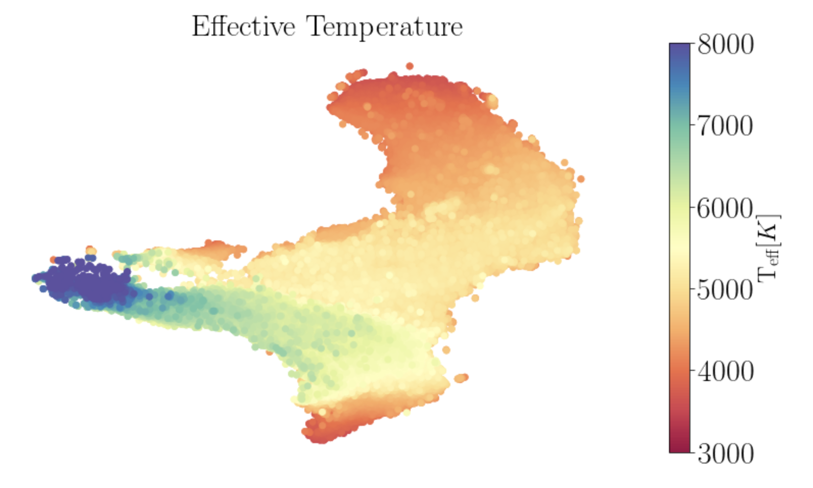
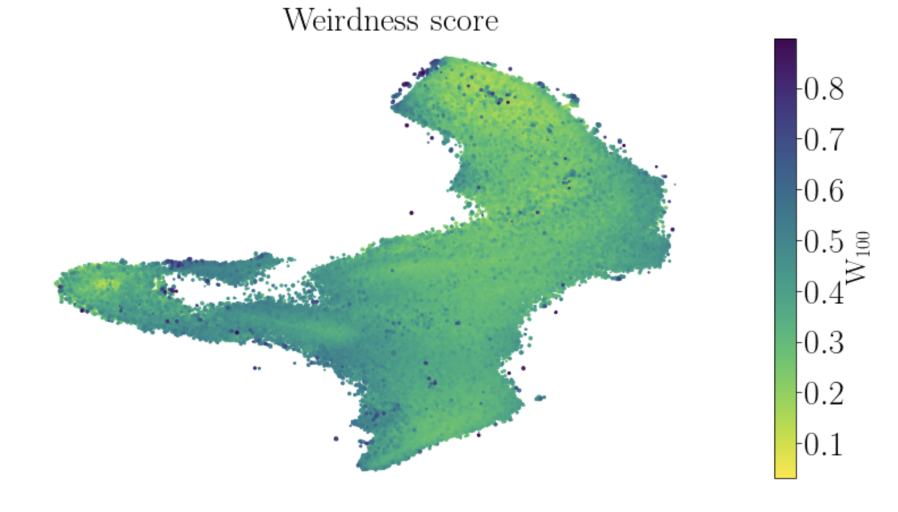

# APOGEE data exploraiton with unsupervised machine learning

This repository contains examples for using the data products from:
[Detecting outliers and learning complex structures with large spectroscopic surveys – a case study with APOGEE stars](https://academic.oup.com/mnras/article/476/2/2117/4848309)

The examples include:
1. Plotting the t-SNE maps that are shown in the paper, such as

2. Given an APOGEE ID, retrive objects with similar spectra

3. Calculate a weirdness score

4. Select objects from the t-SNE map

[See jupyter notebook for more examples](https://nbviewer.jupyter.org/github/ireis/APOGEE_tSNE_nb/blob/master/APOGEE_tSNE_and_NN.ipynb)

